# PulseCal SecureBand - System Architecture

## Executive Summary

PulseCal SecureBand is a government-grade wearable monitoring system designed for prison environments. The system collects biometric and location data from nRF-based wearable devices via BLE, processes it through a secure gateway, backend services, and AI analytics, ultimately presenting insights through a web dashboard.

---

## 1. System Overview

### High-Level Architecture

```
┌─────────────────────────────────────────────────────────────────────────┐
│                         PRISON FACILITY                                 │
│                                                                         │
│  ┌──────────────┐         ┌──────────────┐         ┌──────────────┐  │
│  │  Wearable 1  │         │  Wearable 2  │   ...   │  Wearable N  │  │
│  │  (nRF BLE)   │         │  (nRF BLE)   │         │  (nRF BLE)   │  │
│  └──────┬───────┘         └──────┬───────┘         └──────┬───────┘  │
│         │                        │                        │          │
│         └────────────────────────┼────────────────────────┘          │
│                                  │                                   │
│                         ┌────────▼────────┐                          │
│                         │  BLE Gateway    │                          │
│                         │  (Edge Device)  │                          │
│                         └────────┬────────┘                          │
└──────────────────────────────────┼────────────────────────────────────┘
                                   │
                         ┌─────────▼─────────┐
                         │  Secure Network   │
                         │  (VPN/Tunnel)     │
                         └─────────┬─────────┘
                                   │
┌──────────────────────────────────┼────────────────────────────────────┐
│                    GOVERNMENT DATA CENTER                              │
│                                                                        │
│  ┌──────────────────────────────────────────────────────────────┐   │
│  │                    API Gateway / Load Balancer                │   │
│  └──────────────────────┬───────────────────────────────────────┘   │
│                         │                                             │
│    ┌────────────────────┼────────────────────┐                       │
│    │                    │                    │                       │
│ ┌──▼────────┐    ┌──────▼──────┐    ┌───────▼──────┐               │
│ │  Backend  │    │  Event Bus   │    │  AI Services │               │
│ │  API      │◄───┤  (Message    │───►│  (FastAPI)   │               │
│ │ (NestJS)  │    │   Queue)     │    │              │               │
│ └──┬────────┘    └──────┬───────┘    └───────┬──────┘               │
│    │                    │                    │                       │
│    │            ┌───────▼────────┐           │                       │
│    │            │   Database      │           │                       │
│    │            │   (PostgreSQL)  │           │                       │
│    │            └────────────────┘           │                       │
│    │                                          │                       │
│ ┌──▼─────────────────────────────────────────▼──────┐               │
│ │              Web Dashboard (Next.js)               │               │
│ └──────────────────────────────────────────────────┘               │
└──────────────────────────────────────────────────────────────────────┘
```

---

## 2. Component Diagram

### Detailed Component Architecture

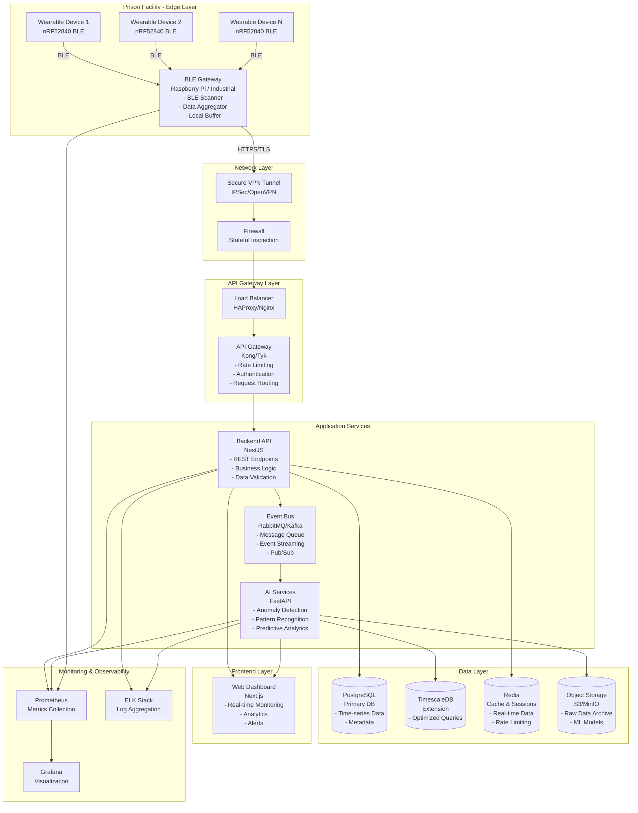

---

## 3. Data Flow (Event-Driven Architecture)

### Event Flow Diagram

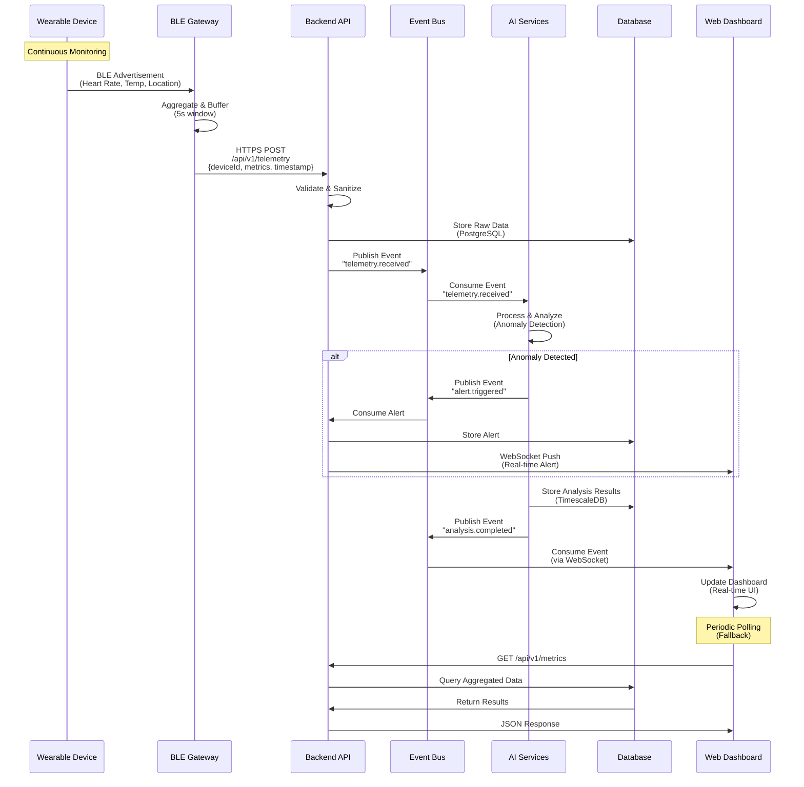

### Event Types and Schema

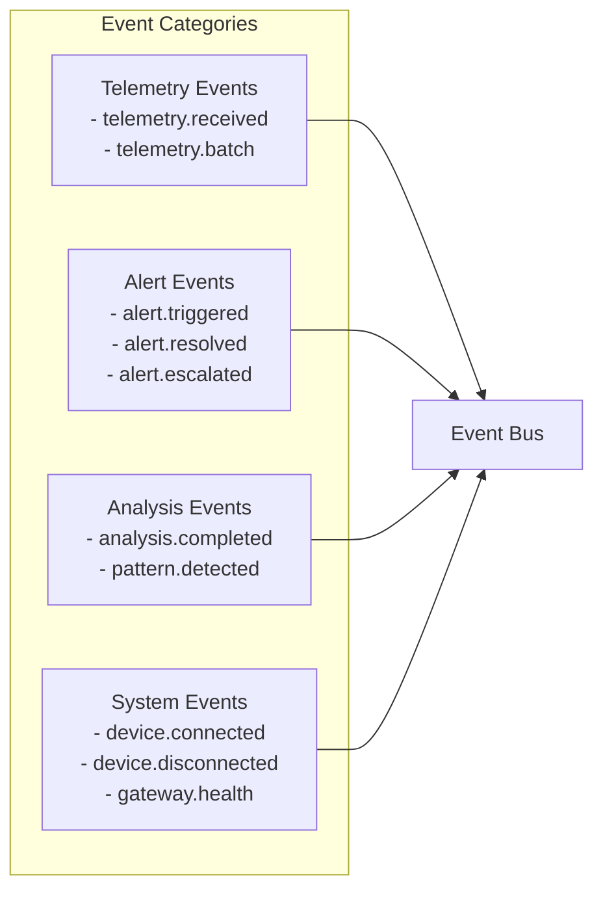

### Event Schema Example

```typescript
// Event: telemetry.received
{
  eventType: "telemetry.received",
  eventId: "uuid",
  timestamp: "ISO8601",
  source: "gateway-id",
  payload: {
    deviceId: "wearable-uuid",
    metrics: {
      heartRate: 72,
      temperature: 36.5,
      batteryLevel: 85,
      location: { x: 123.45, y: 67.89, zone: "A-12" }
    },
    timestamp: "ISO8601",
    signalStrength: -65
  },
  metadata: {
    gatewayVersion: "1.2.3",
    protocolVersion: "2.0"
  }
}
```

---

## 4. Failure Handling Strategy

### Failure Modes and Mitigation

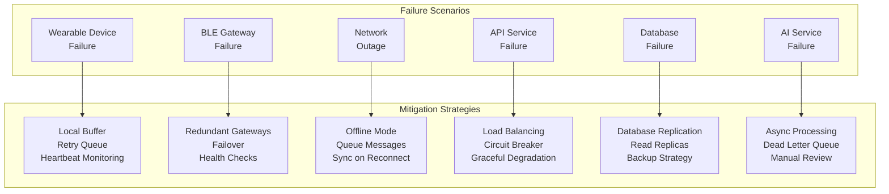

### Circuit Breaker Pattern

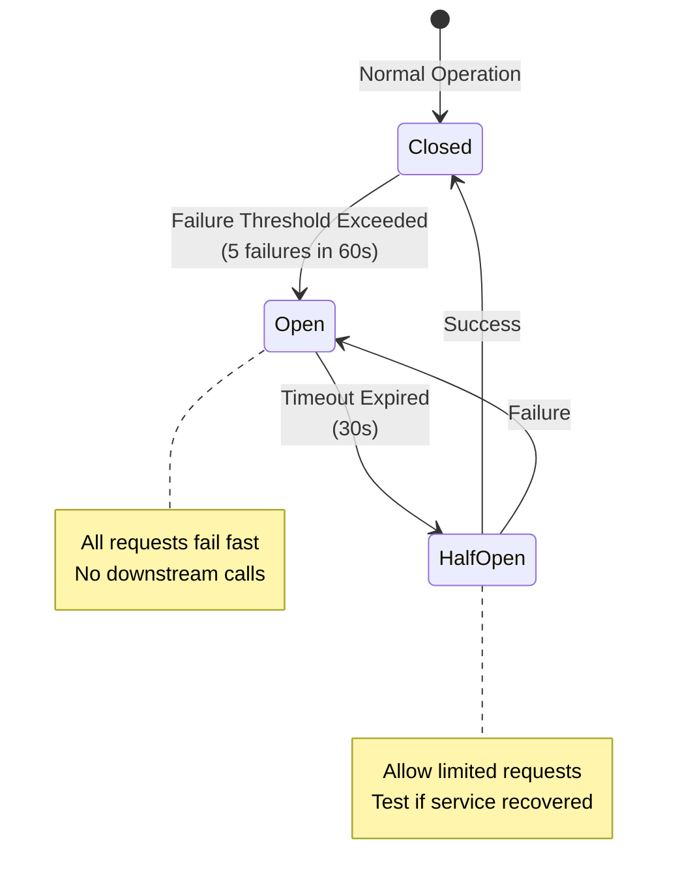

### Retry Strategy

| Component | Retry Policy | Backoff Strategy | Max Attempts |
|-----------|--------------|------------------|--------------|
| Gateway → API | Exponential | 1s, 2s, 4s, 8s | 5 |
| API → Database | Exponential | 100ms, 200ms, 400ms | 3 |
| API → Event Bus | Linear | 500ms intervals | 3 |
| AI Service | Exponential | 2s, 4s, 8s | 3 |

### Data Loss Prevention

1. **Gateway Level**
   - Local SQLite buffer (last 24 hours)
   - Automatic retry with exponential backoff
   - Heartbeat monitoring to detect failures

2. **API Level**
   - Transaction-based writes
   - Write-ahead logging (WAL)
   - Dead letter queue for failed events

3. **Database Level**
   - WAL mode enabled
   - Point-in-time recovery (PITR)
   - Daily backups with 30-day retention

4. **Event Bus Level**
   - Persistent queues (disk-backed)
   - Message acknowledgments
   - Consumer groups for parallel processing

---

## 5. Security Boundaries

### Security Architecture

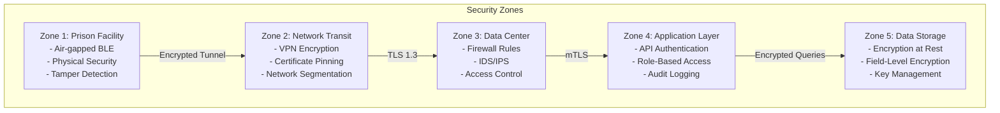

### Authentication & Authorization Flow

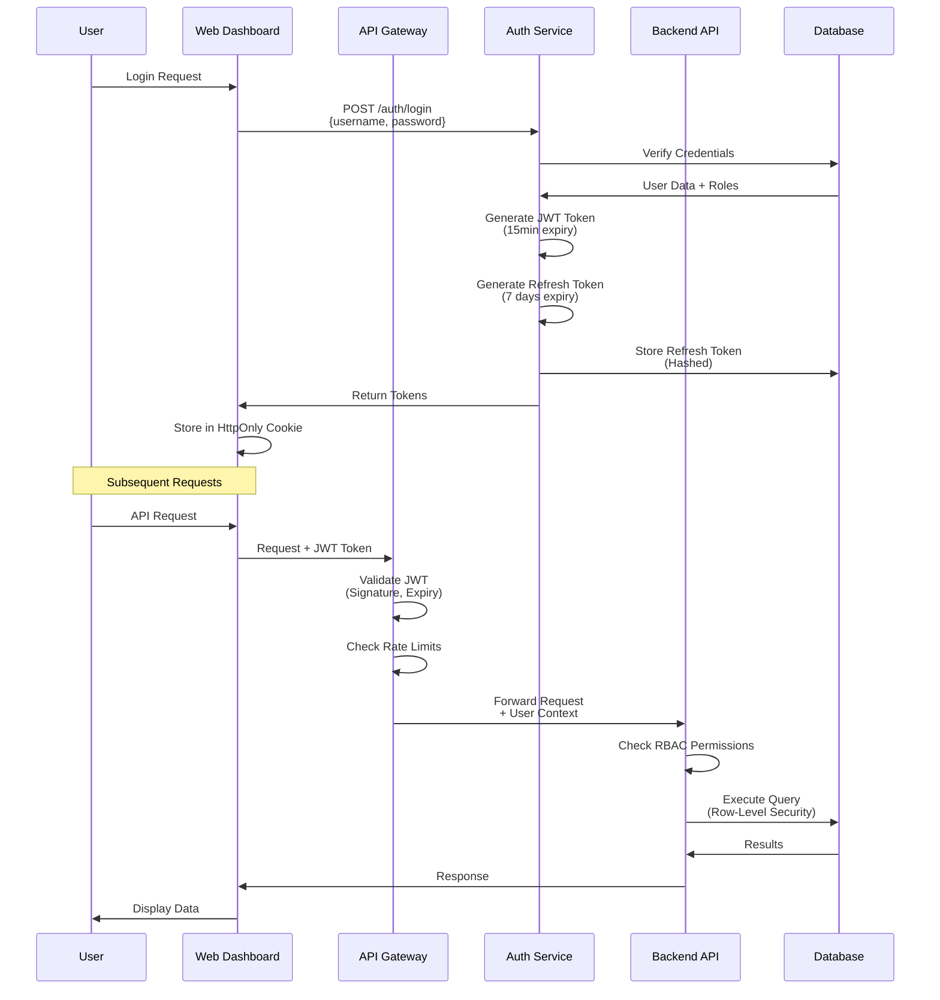

### Security Controls Matrix

| Layer | Control | Implementation | Compliance |
|-------|---------|----------------|------------|
| **Device** | Tamper Detection | Hardware sensors, encrypted storage | FIPS 140-2 |
| **Transport** | Encryption | TLS 1.3, certificate pinning | NIST SP 800-52 |
| **Network** | Segmentation | VLANs, firewall rules | Zero Trust |
| **API** | Authentication | JWT + Refresh Tokens | OAuth 2.0 |
| **API** | Authorization | RBAC, ABAC | NIST 800-53 |
| **Database** | Encryption at Rest | AES-256, TDE | FIPS 197 |
| **Database** | Field Encryption | Application-level encryption | HIPAA |
| **Audit** | Logging | Immutable audit logs | SOC 2 |
| **Data** | PII Protection | Field-level encryption, masking | GDPR |

### Data Classification

```
┌─────────────────────────────────────────────────────────┐
│  Classification Levels                                  │
├─────────────────────────────────────────────────────────┤
│  TOP SECRET    │ Real-time location, biometric data    │
│  SECRET        │ Historical patterns, analysis results │
│  CONFIDENTIAL  │ Aggregated metrics, dashboard data    │
│  PUBLIC        │ System health, non-identifying stats  │
└─────────────────────────────────────────────────────────┘
```

---

## 6. Scaling Approach

### Horizontal Scaling Strategy

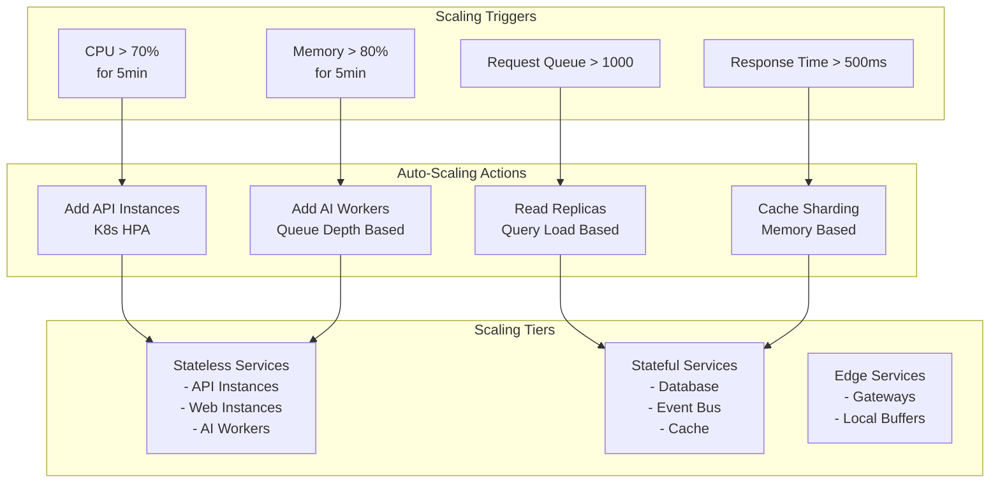

### Scaling Dimensions

#### 1. **Wearable Devices** (10 → 10,000)
- **Challenge**: BLE gateway capacity
- **Solution**: 
  - Multiple gateways per facility (1 gateway per 100 devices)
  - BLE mesh networking for device-to-device communication
  - Gateway clustering with load balancing

#### 2. **API Services** (1 → 100 instances)
- **Challenge**: Stateless scaling
- **Solution**:
  - Kubernetes Horizontal Pod Autoscaler (HPA)
  - Load balancer with health checks
  - Session affinity via Redis (if needed)

#### 3. **Database** (Single → Cluster)
- **Challenge**: Write throughput, query performance
- **Solution**:
  - **Primary-Replica**: 1 write, N read replicas
  - **Sharding**: By facility_id or time_range
  - **TimescaleDB**: Automatic partitioning by time
  - **Connection Pooling**: PgBouncer for connection management

#### 4. **Event Bus** (Single → Cluster)
- **Challenge**: Message throughput
- **Solution**:
  - **RabbitMQ Cluster**: 3-node cluster for HA
  - **Kafka**: For high-throughput scenarios (100K+ msg/s)
  - **Partitioning**: By device_id or facility_id

#### 5. **AI Services** (1 → 50 workers)
- **Challenge**: CPU-intensive processing
- **Solution**:
  - **Queue-based scaling**: Scale workers based on queue depth
  - **GPU acceleration**: For ML model inference
  - **Batch processing**: Process events in batches (100 events/batch)

### Capacity Planning

| Component | Initial Capacity | Scale Target | Scaling Method |
|-----------|------------------|--------------|----------------|
| **Wearable Devices** | 100 | 10,000 | Add gateways (1:100 ratio) |
| **BLE Gateways** | 1 | 100 | Physical deployment |
| **API Instances** | 2 | 50 | K8s HPA (CPU/Memory) |
| **Database** | 1 Primary | 1 Primary + 5 Replicas | Read replicas + sharding |
| **Event Bus** | 1 Node | 3-Node Cluster | RabbitMQ clustering |
| **AI Workers** | 2 | 20 | Queue depth-based scaling |
| **Web Instances** | 2 | 10 | K8s HPA (Request rate) |

### Performance Targets

| Metric | Target | Measurement |
|--------|--------|-------------|
| **API Response Time** | < 200ms (p95) | Prometheus + Grafana |
| **Event Processing Latency** | < 1s (p95) | Event timestamps |
| **Database Query Time** | < 100ms (p95) | PostgreSQL EXPLAIN ANALYZE |
| **Dashboard Load Time** | < 2s | Web Vitals |
| **Real-time Alert Delivery** | < 500ms | WebSocket latency |
| **Data Ingestion Rate** | 10,000 events/sec | Throughput monitoring |

### Caching Strategy

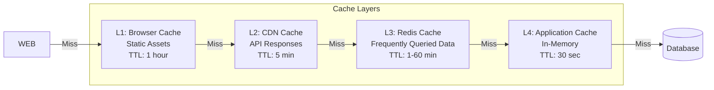

### Database Scaling Strategy

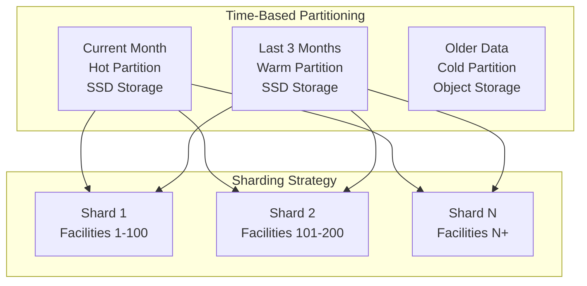

---

## 7. Design Decisions

### 1. **Event-Driven Architecture**
**Decision**: Use message queue (RabbitMQ/Kafka) for asynchronous processing.

**Rationale**:
- Decouples services, enabling independent scaling
- Provides resilience through message persistence
- Enables real-time processing without blocking API responses
- Supports multiple consumers (AI, analytics, alerts)

**Trade-offs**:
- ✅ High throughput, fault tolerance
- ❌ Added complexity, eventual consistency

### 2. **BLE Gateway as Edge Device**
**Decision**: Deploy physical gateway devices in prison facilities.

**Rationale**:
- BLE has limited range (~10m), requires proximity
- Reduces network traffic by aggregating data
- Enables offline operation during network outages
- Provides local buffering and retry logic

**Trade-offs**:
- ✅ Reduced latency, offline capability
- ❌ Hardware deployment, maintenance overhead

### 3. **TimescaleDB for Time-Series Data**
**Decision**: Use PostgreSQL with TimescaleDB extension.

**Rationale**:
- SQL interface (familiar to team)
- Automatic time-based partitioning
- Efficient compression (90%+ reduction)
- Supports both relational and time-series queries

**Trade-offs**:
- ✅ Single database, SQL queries
- ❌ Less specialized than InfluxDB for pure time-series

### 4. **Microservices Architecture**
**Decision**: Separate services (API, AI, Web) with clear boundaries.

**Rationale**:
- Independent deployment and scaling
- Technology diversity (NestJS, FastAPI, Next.js)
- Fault isolation
- Team autonomy

**Trade-offs**:
- ✅ Flexibility, scalability
- ❌ Network overhead, distributed complexity

### 5. **JWT for Authentication**
**Decision**: Use JWT tokens with short expiry + refresh tokens.

**Rationale**:
- Stateless authentication (scales horizontally)
- Industry standard
- Supports role-based access control
- Refresh tokens enable secure long sessions

**Trade-offs**:
- ✅ Scalable, standard approach
- ❌ Token revocation requires blacklist (Redis)

### 6. **Circuit Breaker Pattern**
**Decision**: Implement circuit breakers for external service calls.

**Rationale**:
- Prevents cascade failures
- Fast failure detection
- Automatic recovery testing
- Protects downstream services

**Trade-offs**:
- ✅ Resilience, fast failure
- ❌ Additional complexity

---

## 8. Technology Stack Summary

| Layer | Technology | Rationale |
|-------|-----------|-----------|
| **Wearable** | nRF52840 | Low power, BLE 5.0, secure element |
| **Gateway** | Raspberry Pi / Industrial | Linux, GPIO, network connectivity |
| **API** | NestJS | TypeScript, decorators, enterprise patterns |
| **AI Services** | FastAPI | Python ecosystem, async, ML libraries |
| **Frontend** | Next.js | SSR, performance, React ecosystem |
| **Database** | PostgreSQL + TimescaleDB | ACID, time-series, SQL |
| **Cache** | Redis | In-memory, pub/sub, sessions |
| **Message Queue** | RabbitMQ / Kafka | Reliable, scalable, feature-rich |
| **Container Orchestration** | Kubernetes | Auto-scaling, service mesh, HA |
| **Monitoring** | Prometheus + Grafana | Metrics, alerting, visualization |
| **Logging** | ELK Stack | Centralized logging, search, analysis |

---

## 9. Deployment Architecture

### Kubernetes Deployment

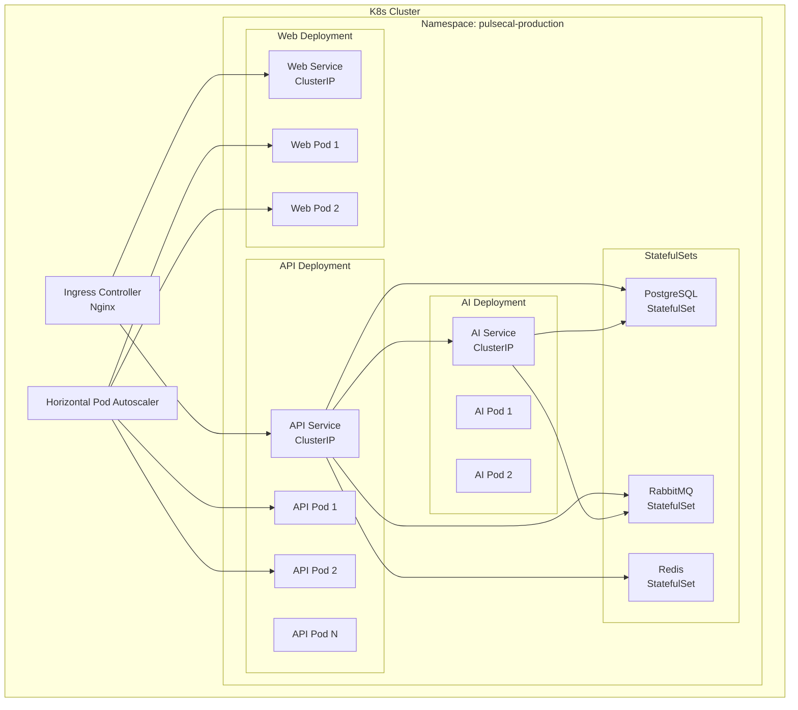

---

## 10. Monitoring & Observability

### Three Pillars of Observability

1. **Metrics** (Prometheus)
   - Request rate, latency, error rate
   - Resource utilization (CPU, memory, disk)
   - Business metrics (devices connected, alerts triggered)

2. **Logs** (ELK Stack)
   - Structured JSON logs
   - Centralized aggregation
   - Search and analysis

3. **Traces** (Jaeger/Zipkin)
   - Distributed tracing
   - Request flow visualization
   - Performance bottleneck identification

### Key Metrics Dashboard

```
┌─────────────────────────────────────────────────────────┐
│  System Health Dashboard                                │
├─────────────────────────────────────────────────────────┤
│  • Active Wearable Devices: 1,234 / 1,500              │
│  • Gateway Health: 12/12 Online                        │
│  • API Requests/sec: 450 (p95: 180ms)                  │
│  • Event Processing Rate: 8,500 events/sec             │
│  • Database Connections: 45/100                        │
│  • Alert Queue Depth: 23                                │
│  • System Uptime: 99.97%                               │
└─────────────────────────────────────────────────────────┘
```

---

## Conclusion

This architecture provides:

✅ **Scalability**: Horizontal scaling from 100 to 10,000+ devices  
✅ **Reliability**: Multi-layer failure handling and redundancy  
✅ **Security**: Defense in depth with encryption, authentication, and audit  
✅ **Performance**: Sub-second response times, real-time processing  
✅ **Maintainability**: Clear boundaries, standard patterns, observability  

The system is designed to meet government security requirements while maintaining high availability and performance for critical monitoring operations.
